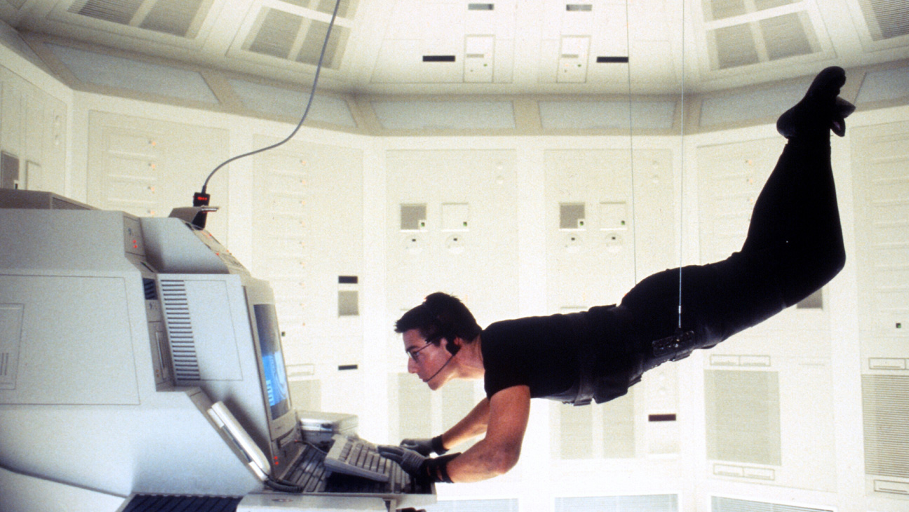

CSS Responsivo

# CSS Responsivo

Em poucas palavras, "Responsividade" é a habilidade de uma página web adaptar sua aparência e _layout_ para promover uma experiência de usuário agradável independente do tamanho da tela do dispositivo. Desenvolver com esse conceito é chamado (RWD) Web Design Responsivo e visa atender os diversos tamanhos e resoluções encontrados nas telas de dispositívos.

## O que vamos aprender?

* A importância de construir páginas web responsivas.

* Como construir páginas web modernas e responsivas usando HTML e CSS.

* Configurar corretamente o _viewport_.

* Criar regras CSS que são aplicadas dependendo do tamanho da tela do dispositivo.

## Por que isso é importante?

No início da _internet_, as pessoas acessavam a rede com seu computador pessoal, conhecido como PC. Mas no final dos anos 2000 com o surgimento dos *smartphones* teve início uma nova era para a internet.

Pode ser que você deixe de lado seu computador pessoal pela praticidade do seu *smartphone*.

Pode ser que você prefira acessar a internet através do seu _smartphone_ ao invés de usar um computador de mesa ou _notebook_. A praticidade que os _smartphones_ trouxeram causou muitas mudanças. Em muitos *sites* se têm percebido um aumento no acesso através de aparelhos portáteis na mesma proporção que se têm notado a diminuição do acesso através de PCs.



**Mission: Impossible | Paramount Pictures**

------

Imagine você tirando seu _smartphone_ do bolso para navegar na internet. Então você acessa uma página que foi desenhada para aparecer na tela do computador.

Clicar em um botão numa tela pequena acaba se tornando uma tarefa impossível.


**Mission: Impossible | Paramount Pictures**

Ainda pior: clicar mais de uma vez no elemento errado pode fazer você desistir de usar a página. O que você pode fazer é dar _zoom_ na página e deslizar em todas as direções até encontrar o que procura. Uma tarefa nada fácil, muitas vezes demorada e cansativa.

Fica claro que uma experiência de usuário agradável é importante independente o dispositivo.

# Conteúdos

Antes de você começar a fazer uma página web responsiva é importante entender alguns conceitos.

## Viewport  - janela de exibição

O primeiro conceito é o viewport: a área visível de uma página web.
Normalmente uma página de internet com uma largura fixa se torna muito larga para caber no viewport de uma tela pequena assim como a de um dispositivo móvel, como um tablet por exemplo. Para contornar isso navegadores de dispositivos móveis reduzem a escala da página inteira até ela caber na tela. Esse é o motívo de uma página que não é responsiva parecer ter o _zoom_ reduzido quando acessada por um dispositivo móvel.

A notícia boa é que você pode controlar o comportamento do viewport em HTML5 usando a _tag_ `<meta>`. Para isso você pode simplesmente incluir essa linha de código no conteúdo da sua `<head></head> `

```html
<meta name="viewport" content="width=device-width, initial-scale=1.0">
```

Primeiro você configura a largura do _viewport_ para ser a mesma largura da tela do dispositivo com: `width=device-width`
Então você configura o nível de _zoom_ inicial para `1.0` ou seja nenhum _zoom_ com: `initial-scale=1.0`

Apesar de você poder utilizar os valores que desejar, é recomendável usar esses valores como um padrão.

## Media Queries  - consultas de mídia

As _media queries_ permitem a você especificar um determinado estilo CSS para uma determinada largura de _viewport_ por exemplo, fazendo sua página responsiva.  Na realidade você pode aplicar estilos com base no resultado de uma ou mais consultas de mídia, que testam o tipo, as caracterísitcas específicas e o ambiente de um dispositivo.

O exemplo a seguir mostra como você pode definir uma _media query_ usando a regra `@media` dentro da sua folha de estilos.

```css
@media screen and (max-width: 768px) {
    body {
    background-color: red;
    }
}
```

*Entendendo o código:* A regra `@media` é seguida pelo tipo de mídia que vamos consultar, `screen` nesse caso (a tela do dispositivo) então temos o operador lógico `and` e por fim a condição para a aplicação da regra, no caso `max-width: 768px` para então definirmos a regra que desejamos aplicar.

Além disso podemos definir múltiplas condições por exemplo máximo e mínimo largura do *viewport*.

```css
@media screen and (min-width: 480px) and (max-width: 800px) {
   body {
     background-color: green;
  }
}
```

Agora o estilo vai ser aplicado em telas com tamanho entre 480 e 800 pixels.

Você também pode definir diversas _medias queries_ para uma única página. Outra possibilidade interessante é definir uma folha de estilos baseado no tipo de mídia:

```css
<!-- Folha de estilo dependente do tipo de mídia  -->
<link rel="stylesheet" media="screen and (min-width: 1024px)" href="widescreen-styles.css" />
```

Nesse exemplo uma folha de estilo `widescreen-styles.css` inteira é usada apenas quando a condição `media="screen and (min-width: 1024px)"` for verdadeira.

Outro valor comum que você pode usar no lugar de `screen` é `print` que define quais regras usar quando o conteúdo for para impressão ou para salvar no formato PDF.

## Unidades Relativas

Quando você estiver desenvolvendo seus estilos evite usar unidades fixas para definir a largura dos elementos. Prefira valores percentuais que permitem aos elementos expandirem até a largura do elemento em que estão contidos. Essa abordagem torna os elementos mais flexíveis, o que é essencial para construir um _design_ responsivo.

CSS permite você definir unidades relativas ao tamanho da fonte `font-size`.

#### A unidade `em`

Ao definir uma propriedade usando a unidade `em` você está dizendo que o tamanho é proporcional a tantas vezes o tamanho da fonte do "elemento pai".
Por exemplo se o corpo da sua página tem um tamanho de fonte de 16 pixels usando `2em` é o mesmo que dizer 32 pixels (16*2) .

Isso é útil porque quando você tem que mudar o tamanho da fonte da sua página, você precisa apenas alterar isso no elemento que o contém. Os elementos filhos vão herdar o tamanho relativo se estes usarem unidades `em`.

Contudo quando definir todos os tamanhos usando `em` você pode acabar criando o efeito cascata. Nessa situação você tem muitos níveis de elementos aninhados usando tamanhos de fonte relativa para os seus correspondentes pais o que resulta em elementos de tamanho difíceis de controlar.

#### A unidade `rem`

Outra unidade relativa é o `rem`. Propriedades definidas com a unidade `rem` são relativas apenas ao tamanho da fonte do elemento raiz que é o elemento `html`.  Isso o torna muito mais fácil de controlar do que `em`.  Configuramos o tamanho da fonte para o elemento `html` e todos tamanhos de fonte usando `rem`.  Tamanhos relativos também pode ser usados para `margin` e `paddings`.

## Vamos praticar!

Chegou a hora de por em prática o que você aprendeu.

Para os próximos exercícios crie uma pasta que contenha os arquivos `index.html` e `styles.css`

Copie o seguinte código e cole dentro do seu arquivo `index.html`:

```html
<!DOCTYPE html>
<html lang="en">
<head>
  <meta charset="UTF-8">

  <link rel="stylesheet" href="styles.css">
  <title>CSS Responsivo</title>
</head>
<body>
  <h1 class="titulo">CSS Responsivo</h1>
  <h2 class="assunto">Introdução ao Responsive Design</h2>
  <p>Um pequeno parágrafo sobre desenvolver páginas web responsivas.</p>
  <div class="left">left</div>
  <div class="right">right</div>
</body>
</html>
```

Copie o seguinte código e cole dentro do seu arquivo `styles.css`:

```css
p {
  font-size: 1.5rem;
}

.left {
  float: left;
  background-color: aquamarine;
}

.right {
  float: right;
  background-color: aqua;
}

.left, .right {
  text-align: center;
  width: 50%;
}

/* Seu código aqui ↓ */
```

### Exercícios:

1. Complete o seguinte código com a `tag` usada para determinar o _viewport_ e adicione ao seu arquivo `index.html`
   
   ```html
   <__________ name="viewport" content="width=device-width, initial-scale=1.0">
   ```

2. Complete o código com o seletor que define o tamanho da unidade relativa `rem` dentro do arquivo `styles.css`
   
   ```css
   __________ {
       font-size: 24px;
   }
   ```

3. Complete o código com uma `media querie` que aplique a regra de estilo em **telas** com **largura de até** `768px`
   
   ```css
   __________ screen and (__________ : 768px) {
       p {
           font-size: 16px
       }
   }
   ```

4. Complete o código para fazer as classes `left`  e `right` ocuparem `100%` da largura em telas **maiores** que `639px` de largura e **menores** que `801px` de largura.
   
   ```css
   __________ screen and (__________: 640px) and (__________: 800px) {
    .left, .right {
      width: 100%;
    }
   }
   ```

5. **BÔNUS** - Crie uma regra que torne o `background-color` de todos os elementos branco somente quando o conteúdo for para impressão.

## Recursos Adicionais

[Design Responsivo - Aprendendo desenvolvimento web | MDN](https://developer.mozilla.org/pt-BR/docs/Learn/CSS/CSS_layout/Responsive_Design)

[HTML Responsive Web Design](https://www.w3schools.com/html/html_responsive.asp)

[HTML5 - Responsive Web Design | Microsoft Docs](https://docs.microsoft.com/en-us/archive/msdn-magazine/2011/november/html5-responsive-web-design)

___
